# Study-R

## Distribuição de Poison
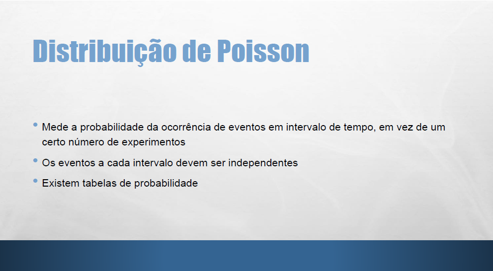

### --
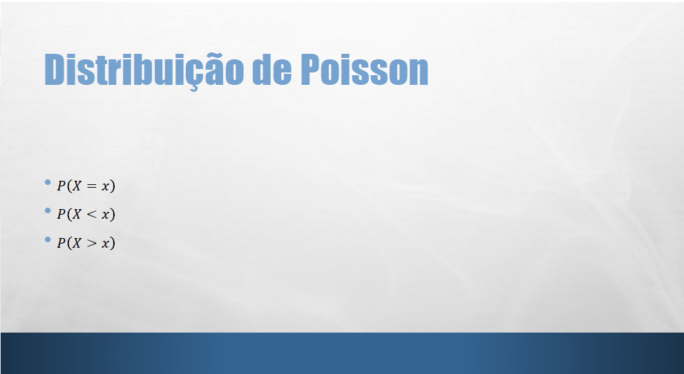

### --
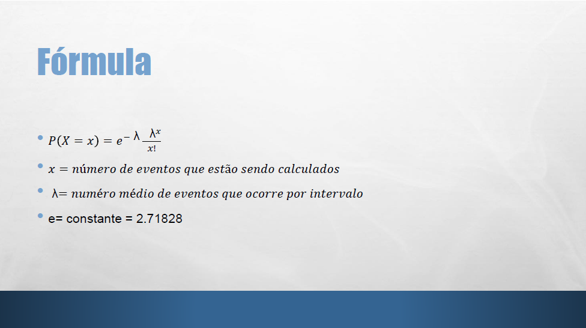

### --
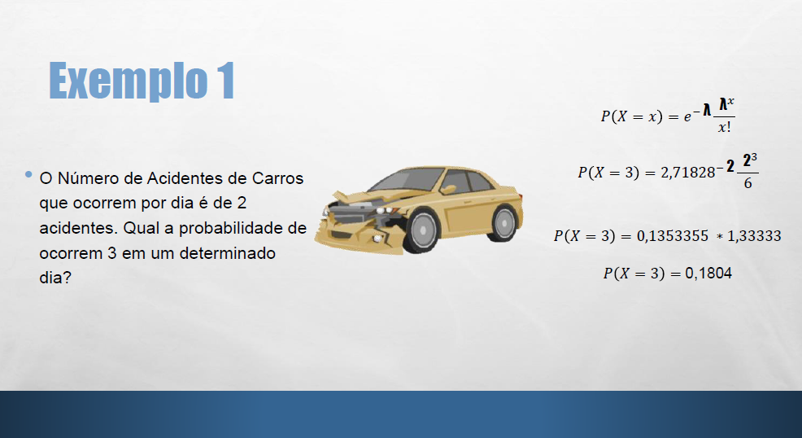

###--
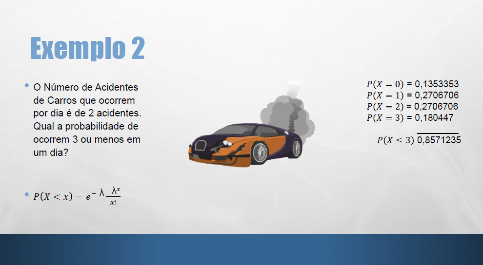

###--
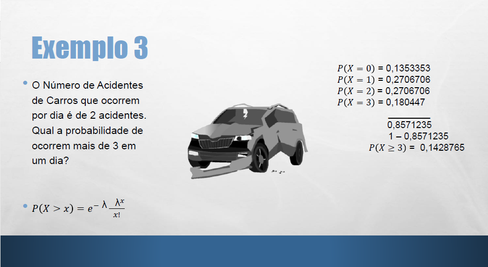

## Anova
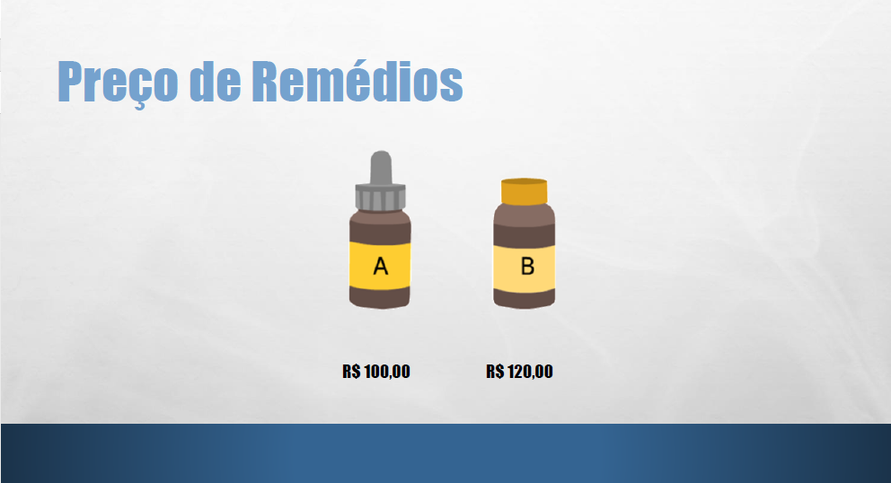

### Comparando
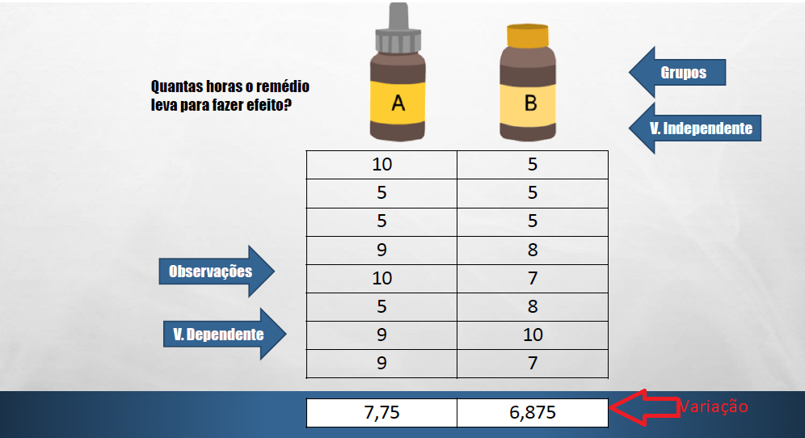

### T-Student X Anova
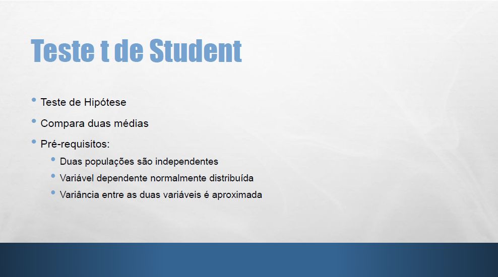

### ....
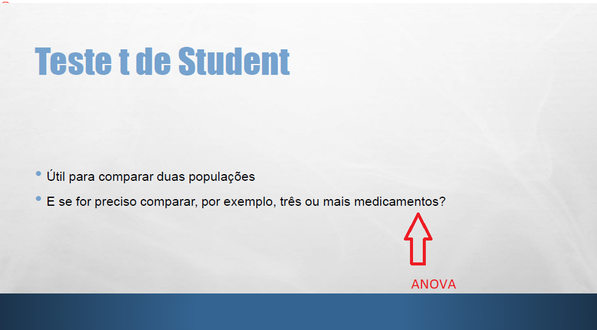

### Analise de Variancia
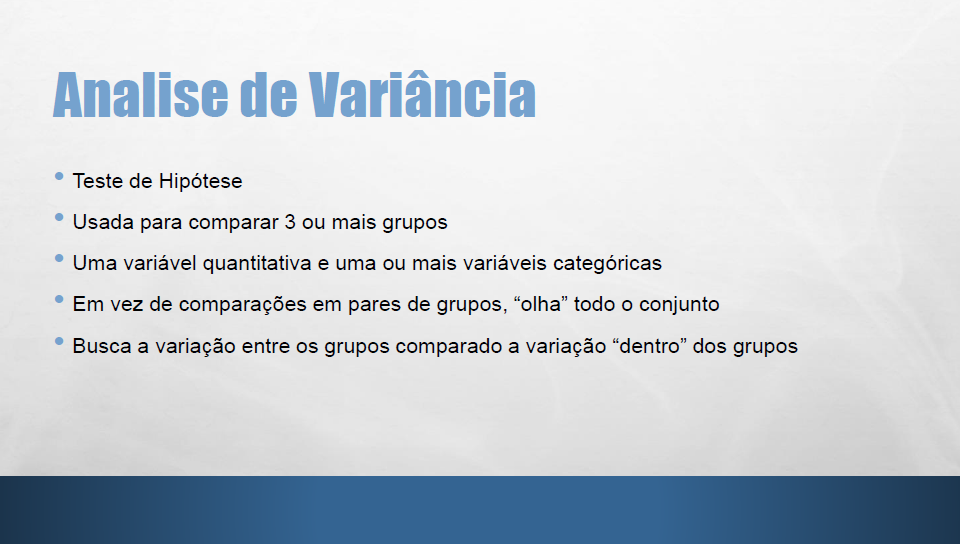

### ....
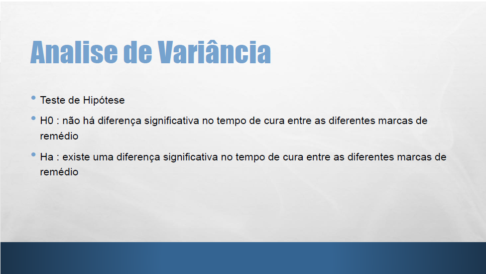

### Teste F
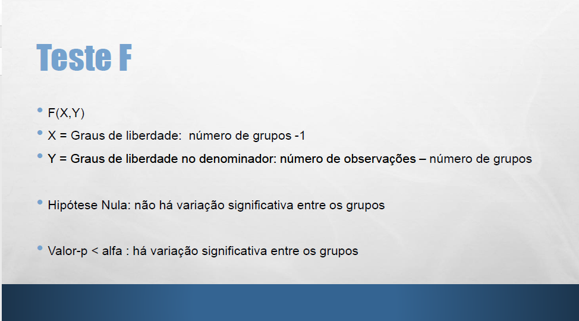

### Analise de Variancia de Dois Fatores
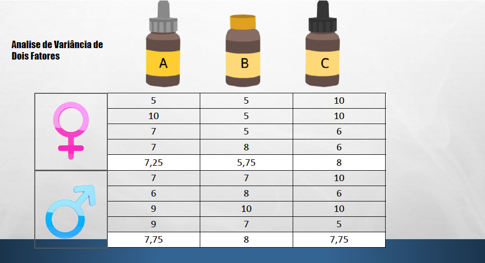

## Existe variação significativa, e agora? 
# Teste de Tukey