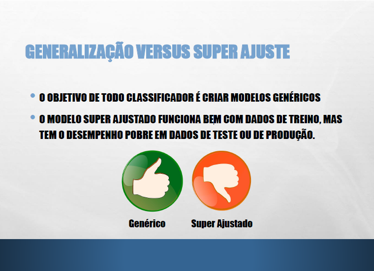
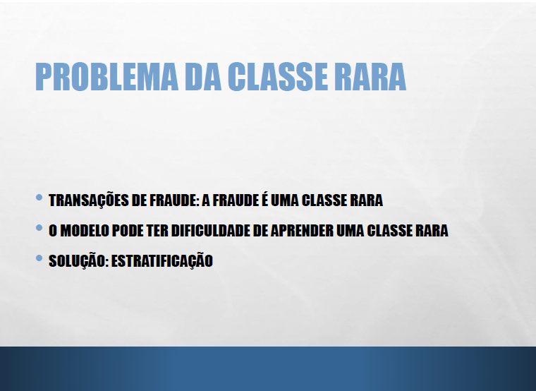
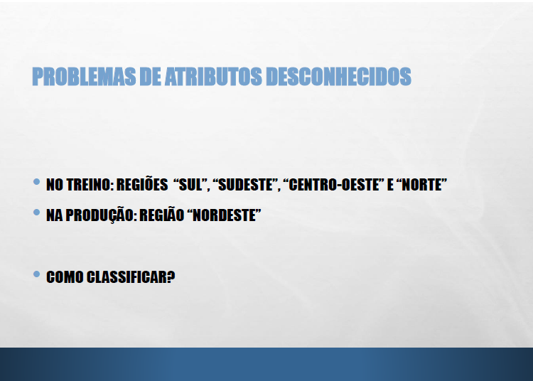
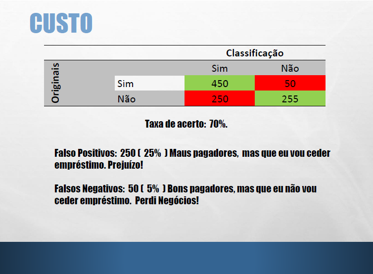
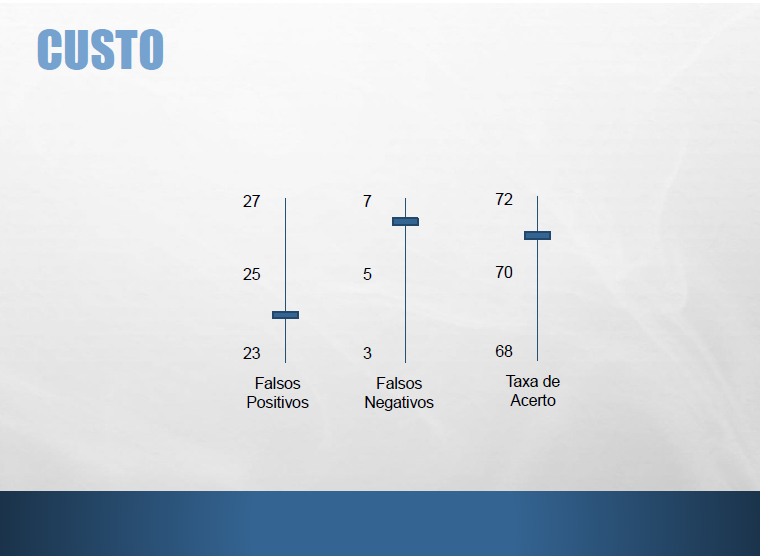
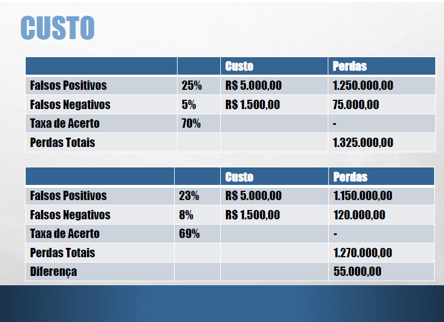
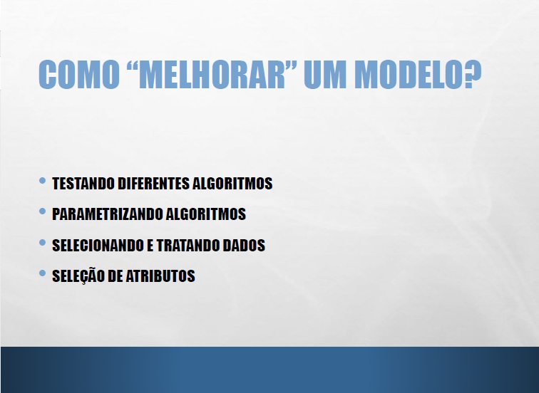
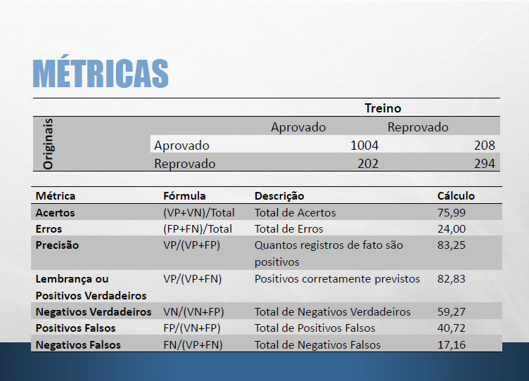

## Stats-R
### Machine-Learning

### Matriz de Confusão

### Classifiers

### Causes

### Classe Rara

### Atributo Desconhecido

### Custo

### Custo II

### Custo III

### Melhorando Modelo

### Métricas

